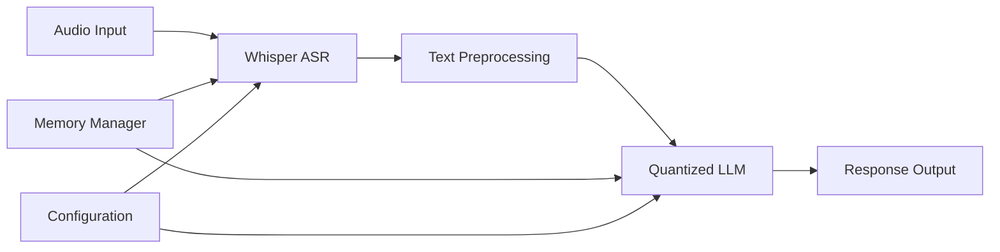

# Design Document

## Overview

The Speech-to-Reasoning Pipeline is a two-stage system that processes audio input through OpenAI's Whisper for transcription, then feeds the resulting text to a quantized large language model for reasoning tasks. The system is designed to run efficiently in Google Colab's constrained GPU environment while maintaining high-quality output.

## Architecture

The pipeline follows a sequential processing architecture:



### Core Components:
1. **Audio Processing Module**: Handles audio input validation and preprocessing
2. **Whisper Integration**: Manages ASR transcription with configurable models
3. **Text Processing**: Prepares transcribed text for reasoning model input
4. **Quantized LLM Handler**: Loads and manages the reasoning model with memory optimization
5. **Pipeline Orchestrator**: Coordinates the end-to-end process
6. **Memory Manager**: Monitors and optimizes GPU memory usage

## Components and Interfaces

### AudioProcessor Class
```python
class AudioProcessor:
    def validate_audio(self, audio_path: str) -> bool
    def preprocess_audio(self, audio_path: str) -> np.ndarray
    def get_audio_duration(self, audio_path: str) -> float
```

### WhisperTranscriber Class
```python
class WhisperTranscriber:
    def __init__(self, model_size: str = "base")
    def transcribe(self, audio: np.ndarray) -> str
    def transcribe_with_timestamps(self, audio: np.ndarray) -> dict
```

### QuantizedLLMHandler Class
```python
class QuantizedLLMHandler:
    def __init__(self, model_name: str, quantization_config: dict)
    def load_model(self) -> None
    def generate_response(self, prompt: str, max_tokens: int = 512) -> str
    def clear_cache(self) -> None
```

### SpeechReasoningPipeline Class
```python
class SpeechReasoningPipeline:
    def __init__(self, whisper_model: str, llm_model: str)
    def process_audio(self, audio_path: str, reasoning_prompt: str = None) -> dict
    def get_pipeline_stats(self) -> dict
```

## Data Models

### AudioInput
- **file_path**: str - Path to audio file
- **format**: str - Audio format (wav, mp3, m4a)
- **duration**: float - Audio duration in seconds
- **sample_rate**: int - Audio sample rate

### TranscriptionResult
- **text**: str - Transcribed text
- **confidence**: float - Transcription confidence score
- **processing_time**: float - Time taken for transcription
- **language**: str - Detected language

### ReasoningResponse
- **response_text**: str - Generated reasoning response
- **input_tokens**: int - Number of input tokens
- **output_tokens**: int - Number of generated tokens
- **processing_time**: float - Time taken for reasoning
- **memory_usage**: dict - GPU memory statistics

### PipelineResult
- **transcription**: TranscriptionResult
- **reasoning**: ReasoningResponse
- **total_time**: float - End-to-end processing time
- **success**: bool - Pipeline execution status

## Error Handling

### Audio Processing Errors
- **InvalidAudioFormat**: Unsupported audio format
- **AudioTooLong**: Audio exceeds maximum duration limit
- **AudioCorrupted**: Audio file is corrupted or unreadable

### Model Loading Errors
- **ModelLoadError**: Failed to load Whisper or LLM model
- **InsufficientMemory**: Not enough GPU memory for model loading
- **QuantizationError**: Issues with model quantization setup

### Processing Errors
- **TranscriptionFailed**: Whisper failed to transcribe audio
- **ReasoningTimeout**: LLM response generation timed out
- **TokenLimitExceeded**: Input exceeds model's token limit

### Error Recovery Strategies
1. **Graceful Degradation**: Fall back to smaller models if memory is insufficient
2. **Retry Logic**: Retry failed operations with adjusted parameters
3. **Memory Cleanup**: Automatic cleanup of GPU memory on errors
4. **User Feedback**: Clear error messages with suggested solutions

## Memory Management Strategy

### GPU Memory Optimization
1. **Model Loading**: Load models sequentially to avoid memory peaks
2. **Cache Management**: Clear intermediate results and model caches
3. **Batch Processing**: Process audio in chunks if necessary
4. **Memory Monitoring**: Track GPU memory usage throughout pipeline

### Quantization Configuration
- **4-bit Quantization**: Use BitsAndBytesConfig for memory efficiency
- **Dynamic Loading**: Load model components on-demand
- **Gradient Checkpointing**: Reduce memory during inference
- **Flash Attention**: Use memory-efficient attention mechanisms

## Model Selection and Configuration

### Whisper Models
- **tiny**: 39M parameters, fastest, lowest accuracy
- **base**: 74M parameters, good balance of speed and accuracy
- **small**: 244M parameters, better accuracy, moderate speed
- **medium**: 769M parameters, high accuracy, slower processing

### Quantized LLM Options
- **Llama-2-7B-Chat-GPTQ**: 4-bit quantized Llama model
- **Qwen-7B-Chat-Int4**: 4-bit quantized Qwen model
- **Mistral-7B-Instruct-v0.1-GPTQ**: 4-bit quantized Mistral model

### Configuration Parameters
```python
WHISPER_CONFIG = {
    "model_size": "base",
    "language": "auto",
    "task": "transcribe"
}

LLM_CONFIG = {
    "quantization": "4bit",
    "max_tokens": 512,
    "temperature": 0.7,
    "top_p": 0.9
}
```

## Testing Strategy

### Unit Tests
1. **Audio Processing Tests**: Validate audio format handling and preprocessing
2. **Whisper Integration Tests**: Test transcription accuracy with known audio samples
3. **LLM Handler Tests**: Verify model loading and response generation
4. **Memory Management Tests**: Ensure proper memory cleanup and optimization

### Integration Tests
1. **End-to-End Pipeline Tests**: Test complete audio-to-response workflow
2. **Error Handling Tests**: Verify graceful handling of various error conditions
3. **Performance Tests**: Measure processing times and memory usage
4. **Model Compatibility Tests**: Test different model combinations

### Performance Benchmarks
1. **Transcription Accuracy**: Word Error Rate (WER) measurements
2. **Response Quality**: Reasoning task performance metrics
3. **Processing Speed**: Time measurements for each pipeline stage
4. **Memory Efficiency**: GPU memory usage profiling

### Test Data Requirements
- **Audio Samples**: Various formats, lengths, and quality levels
- **Ground Truth Transcriptions**: For accuracy validation
- **Reasoning Test Cases**: Logic problems and Q&A scenarios
- **Edge Cases**: Corrupted files, empty audio, very long recordings